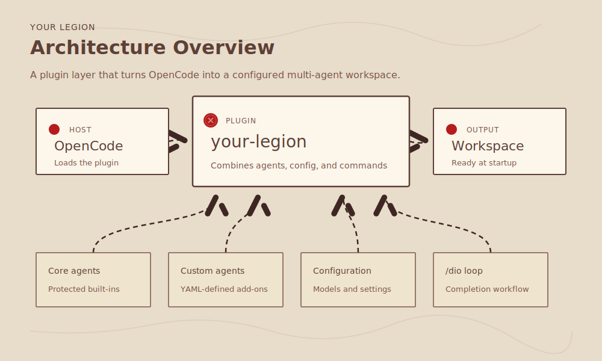

# Your Legion

A plugin-first OpenCode multi-agent system inspired by [`oh-my-openagent`](https://github.com/code-yeongyu/oh-my-openagent).

It provides five protected system agents and YAML-defined custom agents. The plugin injects configured agents into OpenCode at startup and reads per-agent model settings from `legionaries.yaml`.

It also supports `DOMAIN.md`-driven domain packs for a shared Domain Catalog and reusable domain capability documents. Domain packs let the same system and custom agents reference task-specific context such as engineering, marketing, or financial analytics without registering those documents as harness-level skills.



## Quick Start

There are two ways to run the CLI:

- **No global install:** use `bunx @whchi/your-legion <command>`. This is the recommended copy-paste form in these docs.
- **Global install:** after `bun install -g @whchi/your-legion`, you may use `your-legion <command>` directly.

If you have not installed the package globally, commands like `your-legion install` will not exist in your shell.

Install the plugin and restart OpenCode:

```bash
bunx @whchi/your-legion install
```

The installer registers the plugin, writes `~/.config/opencode/legionaries.yaml`, and materializes enabled bundled domain packs under `~/.config/opencode/your-legion/domains/`. The first install enables and writes `coding` by default.

After restart, try a small routing check:

```text
Explore where Your Legion builds the runtime agent config.
```

The `orchestrator` should route repo discovery to `explorer`. For a code change, ask for the change directly; the orchestrator should route implementation to `builder`.

Use these docs next:

- Install and uninstall details: [`INSTALLATION.md`](./docs/INSTALLATION.md)
- Config schema and field rules: [`CONFIGURATION.md`](./docs/CONFIGURATION.md)
- Domain observability and validation: [`DOMAIN_OBSERVABILITY.md`](./docs/DOMAIN_OBSERVABILITY.md)
- Copy-paste examples: [`EXAMPLES.md`](./docs/EXAMPLES.md)
- Development notes: [`DEVELOPMENT.md`](./docs/DEVELOPMENT.md)
- Academic references behind the domain/runtime design: [`academic-papers-summary.md`](./docs/academic-papers-summary.md)

## Install

Run the installer without a global install:

```bash
bunx @whchi/your-legion install
```

Or install the CLI globally first:

```bash
bun install -g @whchi/your-legion
your-legion install
```

On first install, the installer enables `coding` by default and writes the bundled `coding` domain pack to `~/.config/opencode/your-legion/domains/coding/`. On reinstall, `install` preserves the existing `legionaries.yaml`, refreshes plugin registration, and materializes any enabled bundled domain pack that is still missing from the global domains directory.

To replace the enabled domain list with all bundled domains:

```bash
bunx @whchi/your-legion install --domains coding,marketing,finance,accounting
```

To add domains without removing existing enabled domains:

```bash
bunx @whchi/your-legion install --add-domains marketing,finance
```

For full setup, manual install, config paths, backups, and uninstall instructions, see [`INSTALLATION.md`](./docs/INSTALLATION.md).

## Configuration

Model mapping, provider selection, reasoning settings, custom-agent enablement, and domain pack enablement are configured in [`legionaries.yaml`](./legionaries.yaml). See [`CONFIGURATION.md`](./docs/CONFIGURATION.md) for the full schema and examples.

Minimal usable config:

```yaml
system_agents:
  orchestrator:
    model: openai/gpt-5.5
  explorer:
    model: openai/gpt-5.5
  librarian:
    model: openai/gpt-5.5
  planner:
    model: openai/gpt-5.5
  builder:
    model: openai/gpt-5.5
custom_agents: {}
domains:
  coding: true
```

Domain packs live under your global OpenCode config:

```text
~/.config/opencode/your-legion/domains/{domain-id}/
├── DOMAIN.md   # domain description used in the Domain Catalog
├── workflows/   # optional repeatable procedures
├── decisions/   # optional guardrails and constraints
├── examples/    # optional examples and output patterns
└── skills/      # optional domain-local skill instructions
```

These component folders are optional. A domain should contain the facets that carry real knowledge, not empty folders created for symmetry.
`DOMAIN.md` is the only domain description contract used for routing and component discovery.
Runtime component discovery also comes from `DOMAIN.md`: list domain-root relative paths such as `workflows/campaign-planning.md` or `skills/campaign-brief/SKILL.md`. If a folder or path is not listed in `DOMAIN.md`, it is treated as absent.

Enable a domain pack with:

```yaml
domains:
  coding: true
  marketing: true
  finance: true
  accounting: true
```

## Agents

- `orchestrator`: default primary router
- `planner`: design doc and implementation plan writer with docs-only edit permissions
- `builder`: implementation specialist for code, tests, and UI work
- `explorer`: read-only codebase discovery specialist
- `librarian`: read-only documentation and API reference specialist; prefers Context7 MCP for library docs
- `code-reviewer`: bundled YAML custom agent example for read-only review

Custom agents can be added by placing a YAML file under `src/custom-agents/`, then adding a matching `custom_agents` model entry.

Domain descriptions and skills are injected into agent prompts as a Domain Catalog with namespaced entries such as `marketing/campaign-brief`. Agents read the exact configured path; Your Legion does not register domain skills as top-level harness skills.

Delegations use a compact Task Context Envelope with `Objective`, `Active domains`, `Domain refs`, `Domain skills`, `Context refs`, `Constraints`, `Expected output`, and `Verification`. The orchestrator compares the task with the Domain Catalog and activates every domain whose description materially applies. If no domain is configured or no domain description clearly matches, it should use no-domain delegation: `Active domains: none`, `Domain refs: none`, and `Domain skills: none`.

Your Legion records warn-only domain usage evidence under `~/.config/opencode/your-legion/traces/`. Use `bunx @whchi/your-legion check --worktree .` as the main acceptance command for static domain catalog validation and runtime trace validation. Use `bunx @whchi/your-legion trace` when you need raw delegation and domain-read events. See [`DOMAIN_OBSERVABILITY.md`](./docs/DOMAIN_OBSERVABILITY.md) for the full validation workflow.

For a fixed domain-routing smoke test, run `bunx @whchi/your-legion domain-scenarios`, ask the printed prompts in OpenCode, then run `bunx @whchi/your-legion check --worktree . --scenarios`. The fixed set covers coding, marketing, finance, accounting, and their mixed-domain pairs.

The paper references behind description-driven domain selection and trace-based runtime evidence are summarized in [`academic-papers-summary.md`](./docs/academic-papers-summary.md).

The bundled domains are `coding`, `marketing`, `finance`, and `accounting`. `coding` is enabled by default on first install. Enabled bundled domains are copied into the global domains directory when their `DOMAIN.md` is missing; existing global domain folders with `DOMAIN.md` are preserved. Use `--add-domains` to add domains on reinstall, `--domains` to replace the enabled list, or edit `legionaries.yaml` directly.

For hands-on examples of custom agents, marketing domain packs, mixed coding plus marketing work, and domain overrides, see [`EXAMPLES.md`](./docs/EXAMPLES.md).

## Routing Model

Your Legion uses direct specialist routing.

- The `orchestrator` classifies each turn into one dominant intent and chooses a concrete subagent.
- Those intents are routing heuristics, not runtime categories or model profiles.
- Multi-step work goes through `planner` first when sequencing is unclear, then `builder` executes approved implementation work.
- Code review is owned by the `/code-review` command by default; the bundled `code-reviewer` custom agent is available for explicit advanced workflows.
- `legionaries.yaml` controls model and reasoning settings per agent. It does not control routing.

## Commands

- `bunx @whchi/your-legion install [--domains <ids>] [--add-domains <ids>]`: installs or refreshes the plugin registration. First install writes `legionaries.yaml` with `coding` enabled and materializes enabled bundled domain packs under `~/.config/opencode/your-legion/domains/`. Reinstall without domain flags preserves existing config. `--domains` replaces the enabled domain list; `--add-domains` merges into it.
- `bunx @whchi/your-legion create-domain <domain-id> [--components workflows,decisions,examples,skills] [--enable]`: scaffolds a new global domain pack. By default it creates only `DOMAIN.md`; use `--components` to add selected optional folders and matching placeholder files, and `--enable` to write the domain into `legionaries.yaml`. Existing global domains and bundled domain ids are rejected.
- `bunx @whchi/your-legion check [--worktree <path>] [--scenarios]`: runs the main acceptance checks. By default it validates `DOMAIN.md` declarations and runtime trace evidence; `--scenarios` also verifies the fixed scenario set.
- `bunx @whchi/your-legion trace [--worktree <path>] [--limit <n>]`: prints recent domain usage evidence for a worktree.
- `bunx @whchi/your-legion trace-check [--worktree <path>]`: low-level trace validation for contract warnings and declared domain refs or skills that were not read.
- `bunx @whchi/your-legion domain-scenarios`: prints the fixed domain scenario prompts.
- `bunx @whchi/your-legion domain-scenario-check [--worktree <path>]`: low-level fixed scenario validation; `check --scenarios` is the preferred entrypoint.
- `/dio`: a devotio-inspired completion loop that keeps the current session moving until the assistant emits `<dio_complete>...</dio_complete>`, `/dio-stop` is run, or the iteration guard is reached.
- `/dio-stop`: cancels the active DIO loop for the current session.

## Development

Development and contribution notes live in [`DEVELOPMENT.md`](./docs/DEVELOPMENT.md).
